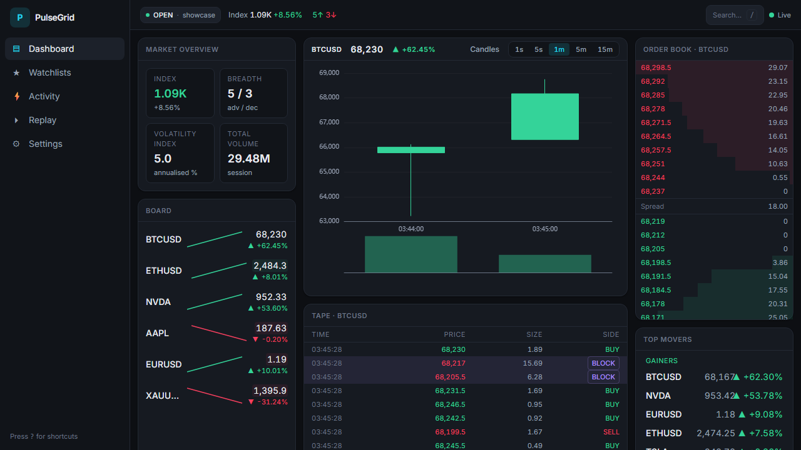
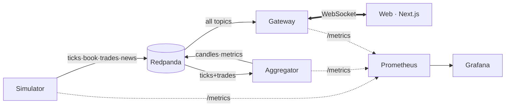
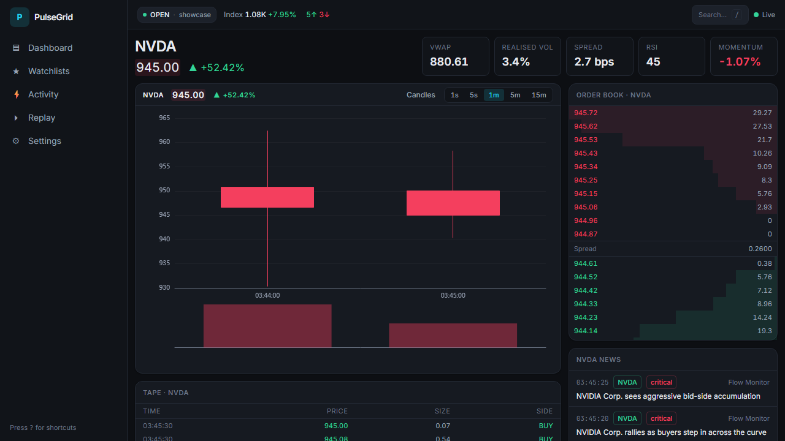
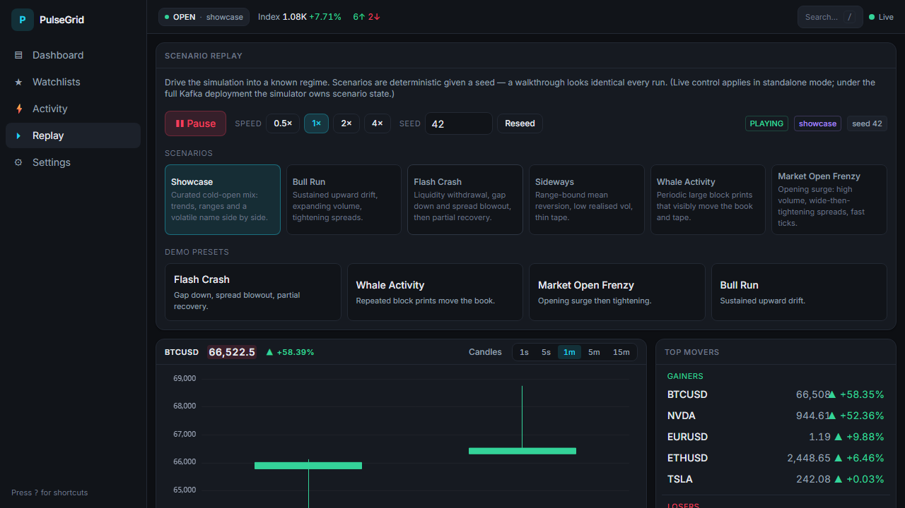

# PulseGrid

[](https://github.com/ayush-algosoft/PulseGrid/actions/workflows/ci.yml)
[](LICENSE)
[](tsconfig.base.json)
[](.nvmrc)

**PulseGrid** is an institutional-style, real-time market intelligence and
trading terminal for monitoring live (simulated) markets, drilling into a single
instrument's microstructure, and replaying deterministic scenarios. It is dense,
fast and information-first — built like an internal trading desk tool.





A market **simulator** publishes a realistic event stream to Kafka (Redpanda);
an **aggregator** derives multi-timeframe candles and market-wide metrics; a
**WebSocket gateway** fans those events out to browsers with per-client
subscriptions and backpressure; and a **Next.js** terminal renders it all at a
true 60 fps feel. Everything is one `docker compose up`.

## Quick start

**One command — the canonical path** (Docker + pnpm installed):

```bash
docker compose up --build
```

Then open:

| URL | What |
|---|---|
| http://localhost:3000 | The PulseGrid terminal |
| http://localhost:3001 | Grafana → *PulseGrid · Pipeline Health* (anonymous admin) |
| http://localhost:9090 | Prometheus |

Topics are created automatically, the simulator auto-seeds the curated
**showcase** market, and the gateway warms up before the first connection — so
**open it cold, touch nothing, and every pane is already alive**: top movers in
both directions, a streaming tape with block prints, a two-sided order book,
news, a populated watchlist, and live breadth/index.

**Local iteration without Docker:**

```bash
pnpm install
pnpm dev          # gateway in standalone mode + web on :3000
```

## Non-goals

- No real brokerage connectivity, real money, or live exchange feeds — **all
  data is simulated**.
- No auth beyond a stubbed single-user session (a clean seam for future SSO; not
  built).
- No portfolio/PnL persistence; watchlists persist locally only.
- No native mobile apps — responsive web only.

## Feature tour

| Screen | Route | What you get |
|---|---|---|
| **Dashboard** | `/` | Streaming chart, board with sparklines, order book, trade tape, top movers, market overview, activity. |
| **Asset detail** | `/asset/[symbol]` | Deep chart with timeframe switching, full depth book, full tape, per-asset stats (VWAP, vol, spread, RSI, momentum) and news. |
| **Replay** | `/replay` | Scenario picker, seed input, transport (play/pause/speed) and one-click deterministic demo presets. |
| **Watchlists** | `/watchlists` | Manage lists; dense sortable grid with inline sparklines. |
| **Activity** | `/activity` | Cross-market feed: large prints, headlines, breadth, most-volatile. |
| **Settings** | `/settings` | Density, reduced-motion, number format, default symbol, depth, connection diagnostics. |
| **Components** | `/dev/components` | Live gallery of the `@pulsegrid/ui` primitives. |

**Keyboard:** `/` command palette · `g d/w/a/r/s` navigate · `?` shortcut
overlay · `Esc` close. **Demo presets** on the Replay screen drive the market
into flash-crash / whale-activity / market-open-frenzy deterministically.
**Resilience states** can be forced on any panel with
`?force=loading|empty|error|disconnected`.




## Performance

The frontend sustains a high-frequency stream at a 60 fps feel by decoupling
data from paint: the single WebSocket client buffers messages and flushes to a
**normalized** Zustand store once per animation frame; the gateway batches
outbound frames at ≈40 Hz with latest-wins coalescing; the trade tape is
virtualized; rows are memoized; and ECharts updates incrementally. A toggleable
**perf overlay** (command palette → *Toggle performance overlay*) shows live fps,
frame count and socket latency so the budget is measured, not asserted.

## Tech stack

pnpm + TurboRepo · TypeScript (strict, `noUncheckedIndexedAccess`,
`exactOptionalPropertyTypes`) · Next.js App Router · React · Tailwind · Zustand ·
TanStack Query/Table/Virtual · ECharts · Framer Motion · KafkaJS + Redpanda ·
`ws` · Zod · Pino · Prometheus + Grafana · Vitest · Playwright.

## Project layout

```
apps/        web · gateway · aggregator · simulator
packages/    schemas · types · utils · ui · config
docs/        architecture · adr · diagrams
infra/       docker · prometheus · grafana
```

Dependency direction is enforced: `types ← schemas ← utils ← (ui, services)`;
`web` may use them all; no app depends on another.

## Development

```bash
pnpm lint        # ESLint across the workspace
pnpm typecheck   # tsc --noEmit everywhere
pnpm test        # Vitest unit + integration
pnpm build       # build all apps
pnpm --filter @pulsegrid/web test:e2e   # Playwright (stack must be up)
```

CI runs lint → typecheck → test → build, then Playwright E2E against a live
stack, on every push and PR.

### Screenshots

Screenshots in `docs/screenshots` are captured from the running app:

```bash
docker compose up --build              # or: pnpm dev
CAPTURE=1 pnpm --filter @pulsegrid/web exec playwright test capture
```

## Roadmap

- Per-channel gap-fill on reconnect (today: snapshot resync — see ADR 0005).
- Persisted scenario runs and a shareable replay URL.
- Multi-node Redpanda + partitioned topics for horizontal fanout.
- OpenTelemetry export to a collector (today: log-correlated spans).
- Server-side watchlist sync behind the stubbed session.

## Key decisions

See [`docs/adr`](docs/adr/README.md) — Redpanda vs Kafka, ECharts, the
normalized store, backpressure policy, reconnect resync, the showcase seed,
deterministic UUIDs, the UI kit, and order-book snapshots. Full system narrative
and the event/topic catalog: [`docs/architecture`](docs/architecture/README.md).

## License

[MIT](LICENSE).
