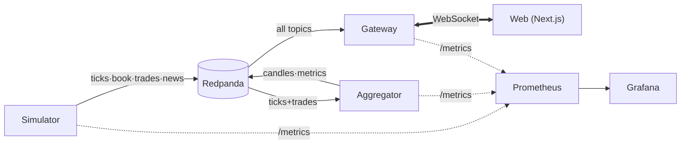

# PulseGrid Architecture

PulseGrid is an event-driven, service-oriented real-time market terminal. This
document is the system narrative: how the services fit together, the exact wire
contracts, the state and performance models, and the design system.

## 1. System overview

Data flows in one direction: the **simulator** generates a realistic market and
publishes raw events to Kafka; the **aggregator** derives candles and global
metrics and publishes them back; the **gateway** consumes every topic and fans
events out to browsers over WebSocket; the **web** app is the only consumer of
the gateway and never talks to Kafka directly.

Shared contracts live in `/packages` and are imported, never copy-pasted. The
dependency direction is strict: `types ← schemas ← utils ← (ui, services)`, and
`web` may depend on `ui`, `types`, `schemas`, `utils`. No app depends on another.

## 2. Services

### Simulator (`apps/simulator`)
The credibility of the platform rests here. The engine (`@pulsegrid/utils`)
drives, per symbol, a geometric-Brownian-motion price process modulated by a
**regime state machine** (`trend-up`, `trend-down`, `range`, `high-vol`) and a
shared market factor for **cross-asset correlation**, plus scenario-specific
drift, jumps and mean reversion. A **persistent two-sided order book** is
consumed by Poisson-arriving trades whose aggressor side tracks short-term
momentum, with occasional block ("whale") prints. Output is byte-deterministic
for a fixed `(seed, scenario, startTime)` — see ADR 0007. The service publishes
ticks, order-book snapshots, trades and news to Kafka and exposes an HTTP
control surface (`/control?scenario=…&seed=…`) plus `/metrics`.

### Aggregator (`apps/aggregator`)
A thin shell over pure, unit-tested logic in `@pulsegrid/utils` (`MarketDeriver`
= `CandleAggregator` + `SymbolStatsTracker` + `buildMarketMetrics`). It consumes
`market.ticks` and `market.trades`, builds OHLCV candles for **1s/5s/1m/5m/15m**
(emitting a `closed` flag on rollover), maintains rolling VWAP / realised
volatility / average spread / RSI / momentum, computes market breadth and the
three top-mover leaderboards on a fixed cadence, and meters per-symbol `seq`
gaps. Restart safety: windows rebuild from the live stream rather than assuming
clean state.

### Gateway (`apps/gateway`)
The only browser-facing service. It consumes Kafka **once** and routes events to
interested clients via an in-memory subscription index keyed by channel string.
Outbound frames are batched at ≈40 Hz with latest-wins coalescing for
high-frequency channels and a never-drop ordered queue for trades/news/closed
candles (ADR 0004). Reconnect is a snapshot resync (ADR 0005). It runs in two
modes — `kafka` (consume Redpanda) and `standalone` (run the engine + deriver
in-process, no Kafka) — selected by `GATEWAY_MODE`. Health: `/healthz`,
`/readyz`; metrics on `METRICS_PORT`.

### Web (`apps/web`)
Next.js App Router terminal UI. See §5–6 for state and performance.

## 3. Event contracts

Every cross-service message is a Zod-validated **envelope** (defined once in
`@pulsegrid/schemas`, types derived via `z.infer`):

| Field | Type | Meaning |
|---|---|---|
| `v` | `1` | Schema version; bump on breaking change (+ ADR & migration note). |
| `id` | uuid | Event id for idempotency (deterministic under replay — ADR 0007). |
| `type` | enum | Discriminator: `tick \| orderbook \| trade \| candle \| metrics \| news`. |
| `symbol` | string | Instrument symbol, or `global` for market-wide events. |
| `ts` | int (ms) | Market-clock time the event represents. |
| `producedAt` | int (ms) | Wall-clock emit time. |
| `seq` | int | Monotonic per `(symbol, type)` for gap detection. |

### Topic catalog

| Topic | Key | Payload (units / ranges) |
|---|---|---|
| `market.ticks` | `symbol` | `price, bid, ask, mid` (quote ccy); `spread` (quote ccy), `spreadBps` (bps); `open/high/low/prevClose` (quote ccy); `change` (quote ccy), `changePct` (%); `volume` (base units, session cumulative). |
| `market.orderbook` | `symbol` | `bids[]`, `asks[]` as `[price, size]` (price quote-ccy, size base units), sorted away from mid; `imbalance` ∈ [-1, 1] (bid-heavy positive). Top-N snapshot (ADR 0009). |
| `market.trades` | `symbol` | `id`, `price` (quote ccy), `size` (base units), `side` (`buy`/`sell` aggressor), `notional` (quote ccy), `isBlock` (bool). |
| `market.candles` | `symbol:tf` | `tf` ∈ {1s,5s,1m,5m,15m}; `candle {t (ms), o,h,l,c (quote ccy), v (base)}`; `closed` (bool); `stats {vwap, realizedVolPct (%), avgSpreadBps (bps), rsi (0–100), momentumPct (%)}`. |
| `market.metrics` | `global` | `status`, `scenario`; `breadth {advancers, decliners, unchanged}`; `indexLevel` (base 1000), `indexChangePct` (%); `volatilityIndex` (%); `totalVolume` (base); `topByChange/topByVolume/topByVolatility` (Mover[]). |
| `market.news` | `symbol` | `id`, `headline`, `source`, `sentiment` (bullish/bearish/neutral), `severity` (info/notable/critical), `score` ∈ [0,1], `tags[]`. |

### WebSocket protocol

Client → server (`{ action }`): `subscribe`/`unsubscribe` with channel strings
(`ticks:AAPL`, `ticks:*`, `book:AAPL`, `trades:*`, `candles:AAPL:1m`,
`news:global`, `metrics:global`), `ping`, `hello` (reconnect), `control`
(replay/scenario). Server → client (`{ type }`): `snapshot`, the envelope events,
`status`, `pong`, `error`. The gateway may also send a JSON **array** of messages
as one coalesced frame; clients handle both shapes.

## 4. Numeric correctness

Prices and sizes never use `===`. `@pulsegrid/utils/decimal` provides `quantize`
(snap to tick size), `eq`/`gt` (epsilon comparison) and `decimalsForTick`. Tick
sizes and base prices per instrument live in `@pulsegrid/utils/assets`.

## 5. State management (web)

- **Server/async state:** TanStack Query (client provider; settings & scenario
  metadata are local-first).
- **Real-time state:** one Zustand store fed by **one** WebSocket client. State
  is normalized (keyed maps by symbol). The client buffers messages and flushes
  to the store once per `requestAnimationFrame` (ADR 0003). Components read
  narrow selectors at the leaf, so a tick for one symbol doesn't re-render
  others.
- **One socket, one source of truth:** a refcounted subscription manager maps
  store needs ↔ gateway channels — panels `useChannels([...])` and the client
  subscribes/unsubscribes as components mount/unmount.

## 6. Performance strategy

- Decouple data from paint: rAF batching, never `setState` per message.
- Virtualized trade tape (`@tanstack/react-virtual`).
- Memoized rows (`TickerRow`) + stable keys.
- Copy-on-write store updates keep unchanged refs stable for selective
  re-render.
- ECharts incremental option diffing instead of full chart re-renders.
- A toggleable **perf overlay** (command palette → "Toggle performance overlay")
  shows live fps, frame count, socket latency and last-batch age for verifying
  the budget.

## 7. Design system

Defined once in `@pulsegrid/ui/tokens.ts` and consumed via the Tailwind preset
and ECharts theme.

- **Surfaces:** obsidian → base → surface → panel → elevated; depth via subtle
  surface shifts and low-spread shadows, not glow.
- **Accents (semantic):** emerald = **up/positive**, rose = **down/negative**,
  cyan = informational/selection, violet = special/replay & block prints.
- **Up/down is never colour alone** — values pair with a ▲/▼ glyph and sign
  (`ChangeBadge`, `directionGlyph`) for accessibility.
- **Typography:** tabular figures for every number so columns align and digits
  don't jitter; Inter for UI, JetBrains Mono for data.
- **Motion:** value flashes, smooth chart transitions and hover states only —
  all gated by `prefers-reduced-motion` and a Settings toggle.

### Component inventory (`@pulsegrid/ui`, shown live at `/dev/components`)

`Button`, `Card`, `Panel`, `Badge`, `Kbd`, `Skeleton`; `LoadingState`,
`EmptyState`, `ErrorState`, `DisconnectedBanner`; `TickerValue` (flash-on-change),
`ChangeBadge`, `Sparkline`, `ConnectionDot`, `MarketStatusPill`,
`TimeframeSwitcher`, `StatTile`, `OrderBookLadder`.

**Do:** keep numbers tabular; pair colour with glyph; use `Panel` for every
pane; read live data via selector hooks at the leaf. **Don't:** introduce raw
hex (use tokens); animate without honoring reduced motion; subscribe to the whole
store in a component.

## 8. Resilience & the showcase state

Every async surface renders one of four explicit states via `AsyncContent`:
**loading** (skeletons), **empty** (instructive), **error** (retry), and
**disconnected** (banner + auto-reconnect). Append
`?force=loading|empty|error|disconnected` to any URL to force them for
demos/screenshots. The default `showcase` scenario (ADR 0006) plus a ~320-tick
gateway warmup guarantee a cold open lights up every pane.

## 9. Observability

Structured Pino logs across services; Prometheus metrics (gateway: clients,
frames/sec, coalesced frames, events ingested, Kafka-connected; aggregator:
events consumed, candle closes, seq gaps; simulator: events produced); a
lightweight OTel-shaped span helper (`startSpan`) for log correlation; and a
provisioned Grafana **Pipeline Health** dashboard auto-loaded by Compose.
